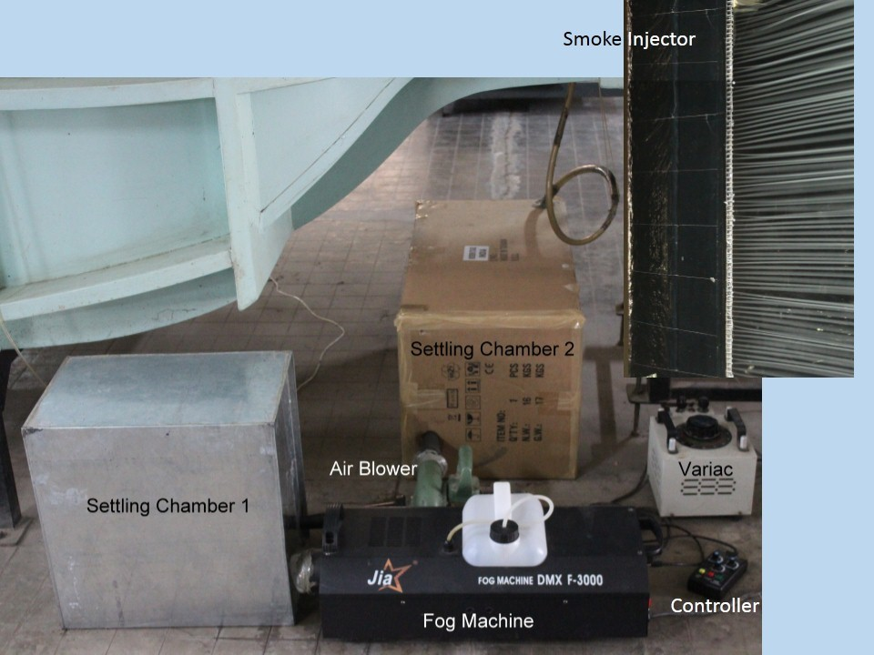

# Theory:

Smoke flow visualization is a qualitative technique used to analyze the flow behavior. The smoke follows the air currents, allowing the observer to visualize the flow. A smoke generator is coupled with an air blower and a settling chamber. From this chamber, smoke is fed to smoke injector, which has a shape of an airfoil with a number of small diameter tubes placed at trailing edge. The smoke exit the injector as a sheet. The smoke sheet moves with the air and deforms, describing the flow pattern. The ability to see flow pattern on a model often gives insight into aerodynamic behavior.

For the injection of smoke into the wind tunnel a symmetric airfoil shaped smoke injector was used (Figure1). At the trailing edge of the airfoil, several small diameter stainless steel tubes are fixed. These tubes are connected to a pipe, which run through the span of airfoil carrying smoke. Direct feeding of smoke into the pipe induces turbulence, which was evident in the flow at the exit of smoke generator. To avoid turbulence two settling chambers and a blower are used upstream of the pipe. The smoke is first fed to one of the settling chambers, which reduces the incoming turbulence from smoke generator. Then blower sucks the smoke out and feeds it to the other settling chamber that reduces the turbulence generated due to blower and then it is fed to the pipe inside the smoke injector. This arrangement helped in creating a streamlined sheet of smoke.

In steady flows, the streak lines formed by smoke are coincident with streamlines of the flow. In the unsteady flow generated by the rotating and accelerating wings, however, the streak lines of the smoke will deviate from the streamlines over time, because the shape of the smoke lines represents not the current movement of the fluid, but the current movement plus the spatially integrated time history of recent motions. Thus, care must be taken in the interpretation of individual smoke visualizations, but the problem is greatly eased by considering the movement of the flow field indicated by the smoke lines in a series of images making up an animation. The instantaneous flow can be determined from the movement of the smoke lines without the observer becoming overly distracted by discrete features (kinks, loops), which may represent historical, rather than actual, flow features. 

 Smoke introduced into the flow in a region where vorticity is generated, moves with the fluid. Like vorticity, the smoke pattern is Galilean invariant, so the smoke pattern does not depend on the frame of reference of the observer, making it uniquely suitable for studying flow associated with different models, where the frames of reference are extremely complex. In the flow visualizations presented here, smoke is released into the flow far upstream and then passively transported by the laminar flow through the tunnel to the model. The topology of the flow can be simply reconstructed by following these smoke lines and identifying the flow structures points in the flow field.

## Apparatus
1.	Wind tunnel
2.	Models (small cylinder, large cylinder and airfoil)
3.	Smoke flow setup
    - Smoke generator
    - Smoke injector

 

#### Figure 1: Smoke lines generation setup

